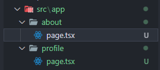
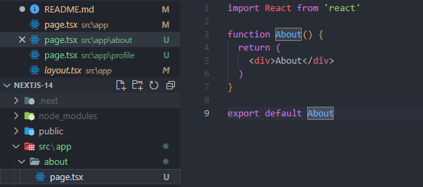

# Next.Js

## Routing

- Next.js has a file-system based routing mechanism
- URL paths which users can access in the browser are defined by files and folders in your codebase
  _To create about page_
  We need to create about folder and file with name: page.tsx

Folder structure

about/page.tsx

