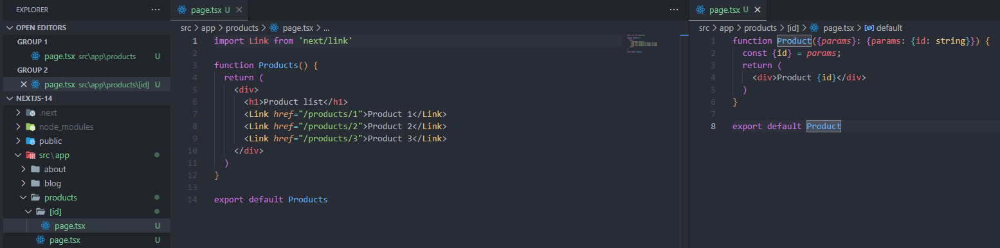
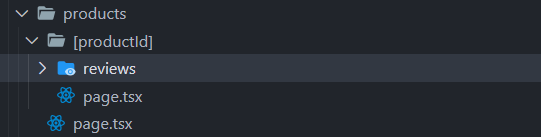
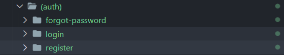

# Next.Js

## Routing

- Next.js has a file-system based routing mechanism
- URL paths which users can access in the browser are defined by files and folders in your codebase
  _To create about page_
  We need to create about folder and file with name: page.tsx

Folder structure

about/page.tsx

## Dynamic routes

To create list products and view detail individual product through url path
/products/1 and /products/2

product detail page receives params as a props and get id of product

if we name dynamic routes as id, we can get

    const id = params.id

if we name dynamic routes as slug, we can get

    const slug = params.slug

## Dynamic nested route

To create review detail page of a product 1

products/1/reivews/3

Then we create reviews and reviewId inside

In the last level of nested route, we can receive all parameters of url path

## Route group

With this structure, we don't need to add auth route in url path

To view login page
http://localhost:3000/login
To view forgot password page
http://localhost:3000/forgot-password
To view forgot register page
http://localhost:3000/register
